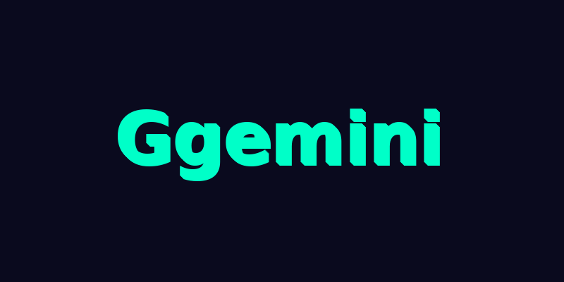
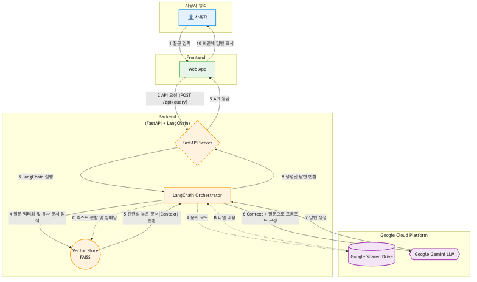
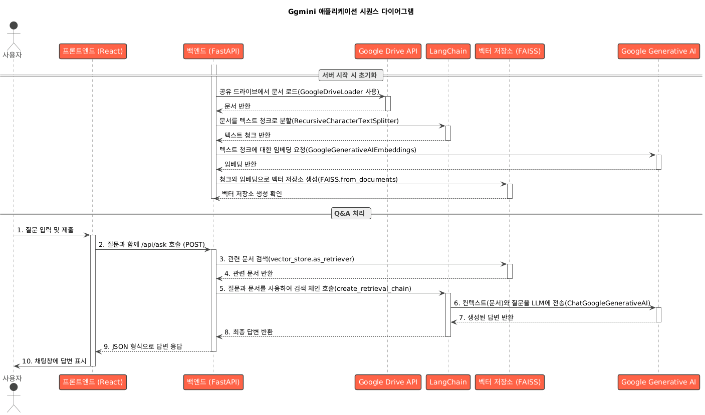

<p align="center">
  
</p>

# Ggemini (Google Drive 검색 기반 QnA 파이프라인)

이 프로젝트는 검색 증강 생성(Retrieval-Augmented Generation, RAG) 파이프라인을 사용하는 질의응답(QnA) 시스템입니다. Google Drive에 저장된 문서에서 관련 정보를 검색하고, 대규모 언어 모델(LLM)을 사용하여 사용자 질문에 대한 답변을 생성합니다.

## 아키텍처

다음 다이어그램은 시스템의 전체 아키텍처를 보여줍니다.


## 시퀀스 다이어그램

이 시퀀스 다이어그램은 QnA 프로세스 중 구성 요소 간의 상세한 상호 작용을 보여줍니다.


## 주요 기능

*   **검색 증강 생성(RAG):** RAG 파이프라인을 사용하여 Google Drive에 저장된 문서를 기반으로 답변을 제공합니다.
*   **FastAPI 백엔드:** 백엔드는 고성능 API를 제공하는 FastAPI로 구축되었습니다.
*   **React 프론트엔드:** 사용자 인터페이스는 React로 구축된 단일 페이지 애플리케이션입니다.
*   **LangChain:** LangChain은 문서 로딩, 텍스트 분할, 임베딩 및 LLM과의 상호 작용을 포함한 RAG 파이프라인을 조율하는 데 사용됩니다.
*   **Google Gemini:** Gemini 모델이 답변 생성을 위한 LLM으로 사용됩니다.
*   **FAISS:** FAISS는 벡터 임베딩의 효율적인 유사성 검색을 위해 사용됩니다.

## 시작하기

### 사전 요구 사항

*   Python 3.13+
*   Node.js 및 npm
*   Google Drive API 및 Generative AI API가 활성화된 Google Cloud Platform 프로젝트
*   Google Drive API에 액세스할 수 있는 Google Cloud 서비스 계정의 사용자 인증 정보

### 백엔드 설정

1.  **백엔드 디렉토리로 이동합니다:**
    ```bash
    cd backend
    ```

2.  **가상 환경을 만들고 활성화합니다:**
    ```bash
    python -m venv .venv
    source .venv/bin/activate
    ```

3.  **필요한 Python 패키지를 설치합니다:**
    ```bash
    pip install -r requirements.txt
    ```

4.  **환경 변수를 설정합니다:**
    `backend/.config` 디렉토리에 `.env` 파일을 만들고 다음을 추가합니다.
    ```
    GOOGLE_DRIVE_FOLDER_IDS=your_google_drive_folder_ids
    LLM_MODEL={gemini_model}
    LLM_TEMPERATURE={temperature}
    ```

5.  **백엔드 서버를 실행합니다:**
    ```bash
    uvicorn app.main:app --reload
    ```

### 프론트엔드 설정

1.  **프론트엔드 디렉토리로 이동합니다:**
    ```bash
    cd frontend
    ```

2.  **필요한 Node.js 패키지를 설치합니다:**
    ```bash
    npm install
    ```

3.  **프론트엔드 개발 서버를 실행합니다:**
    ```bash
    npm run dev
    ```

## API 엔드포인트

### `POST /api/query`

*   **Request body:**
    ```json
    {
      "question": "질문을 입력하세요"
    }
    ```
*   **Response body:**
    ```json
    {
      "answer": "생성된 답변"
    }
    ```